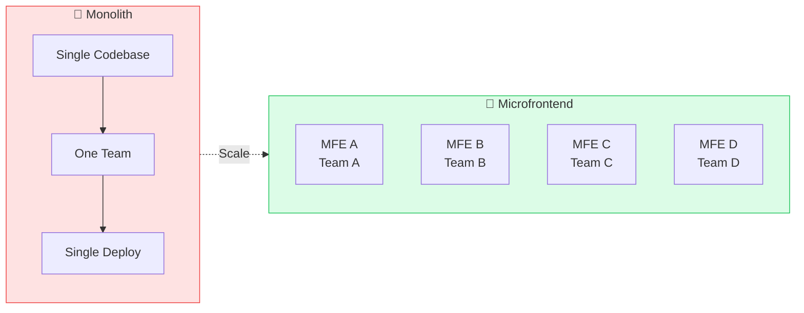
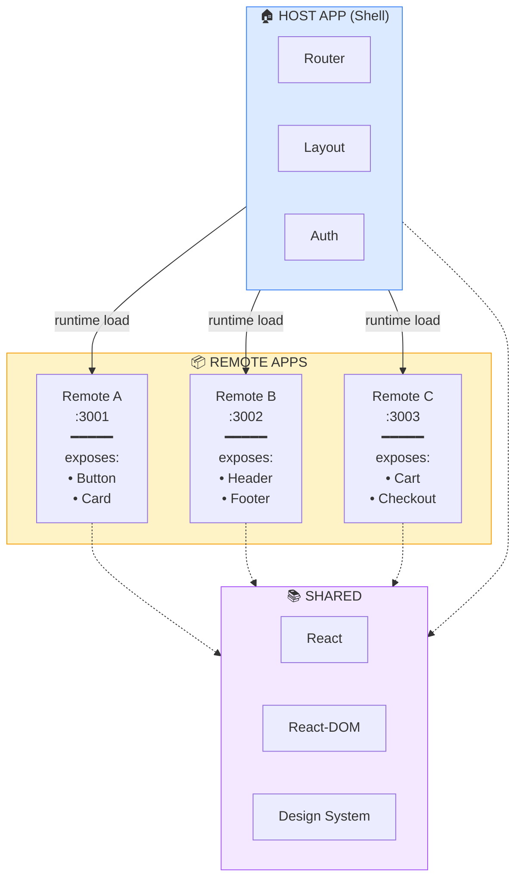
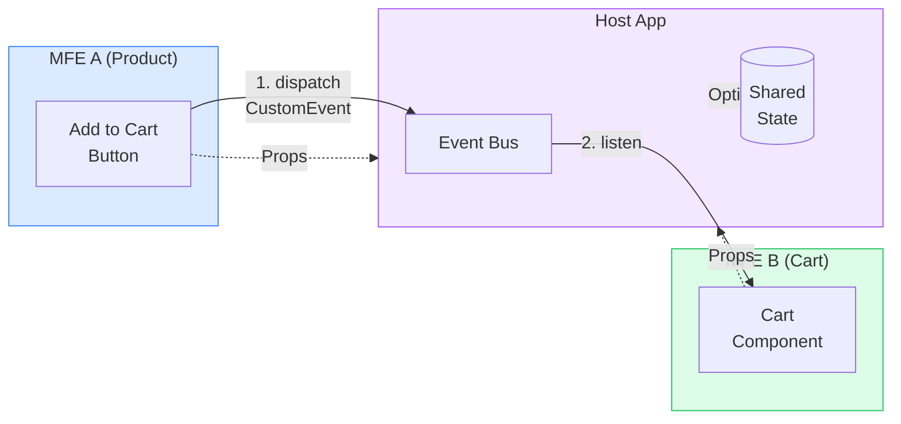
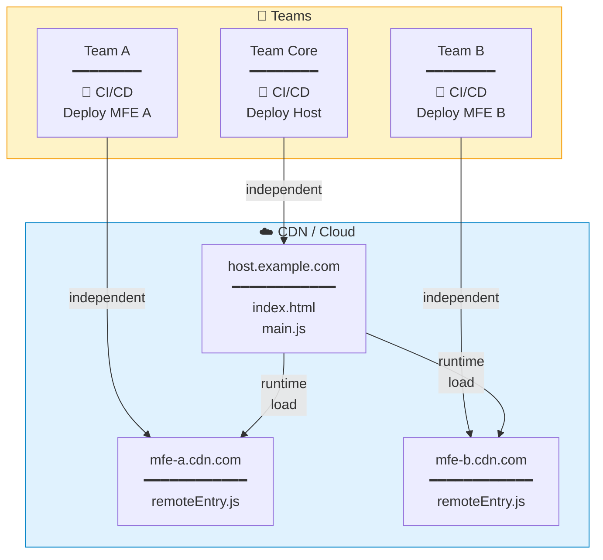
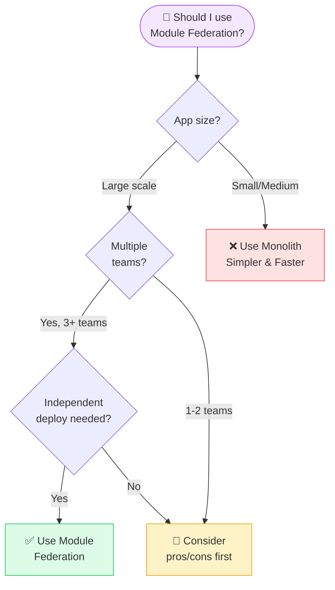

# Design Specs: บทความ Microfrontend with Module Federation

> **Designer**: @Designer
> **Date**: 2026-02-02
> **Status**: Design Complete
> **Specs Reference**: US-021 (specs.md)

---

## 1. Design Research Summary

### Existing Components (จาก Deep Scan)
- ✅ **CodeBlock.tsx** - Syntax highlighting พร้อมใช้ (Shiki)
- ✅ **Badge.tsx** - สำหรับ tags และ categories
- ✅ **Card.tsx** - Container component
- ✅ **Button.tsx** - Interactive elements
- ✅ **parseContent.tsx** - Markdown parser
- ⚠️ **ไม่มี Table component** - ต้องเพิ่มใน parser
- ⚠️ **ไม่มี Callout/Note box** - ต้องเพิ่มใน parser
- ⚠️ **ไม่มี Mermaid support** - ต้องเพิ่มสำหรับ diagrams

### Design Patterns (จาก Deep Research)
- ใช้ **Mermaid.js** สำหรับ diagrams (version-control friendly)
- ใช้ **flowchart** และ **architecture diagram** syntax
- SVG output สำหรับ crisp scaling
- Keep diagrams simple และ focused

---

## 2. Article Layout Structure

### Overall Layout
```
┌─────────────────────────────────────────────────────────┐
│                      HEADER                             │
├─────────────────────────────────────────────────────────┤
│  ← Back to Posts                                        │
├─────────────────────────────────────────────────────────┤
│                                                         │
│  ┌─────────────────────────────────────────────────┐   │
│  │              COVER IMAGE                        │   │
│  │         (16:9 aspect ratio)                     │   │
│  │   Microfrontend Architecture Illustration       │   │
│  └─────────────────────────────────────────────────┘   │
│                                                         │
│  [Badge: Architecture]                                  │
│                                                         │
│  # Microfrontend แบบ Module Federation                  │
│     คู่มือฉบับสมบูรณ์ 2026                               │
│                                                         │
│  👤 DevTalk Team  •  📅 2026-02-XX  •  ⏱ 15 min read   │
│                                                         │
├─────────────────────────────────────────────────────────┤
│                   ARTICLE CONTENT                       │
│                   (max-width: 3xl)                      │
│                                                         │
│  ┌─ Section 1 ────────────────────────────────────┐    │
│  │ ## Microfrontend คืออะไร?                      │    │
│  │ Paragraph text...                              │    │
│  │ ┌─ Diagram 1 ─────────────────────────────┐   │    │
│  │ │  Monolith vs Microfrontend comparison   │   │    │
│  │ └─────────────────────────────────────────┘   │    │
│  └────────────────────────────────────────────────┘    │
│                                                         │
│  ┌─ Section 2 ────────────────────────────────────┐    │
│  │ ## เปรียบเทียบ Approaches                      │    │
│  │ ┌─ Comparison Table ──────────────────────┐   │    │
│  │ │ Approach | Pros | Cons | When to use   │   │    │
│  │ └─────────────────────────────────────────┘   │    │
│  └────────────────────────────────────────────────┘    │
│                                                         │
│  ┌─ Section 3 ────────────────────────────────────┐    │
│  │ ## Module Federation คืออะไร?                  │    │
│  │ ┌─ Diagram 2 ─────────────────────────────┐   │    │
│  │ │  Module Federation Architecture         │   │    │
│  │ └─────────────────────────────────────────┘   │    │
│  └────────────────────────────────────────────────┘    │
│                                                         │
│  ... more sections with code blocks and diagrams ...   │
│                                                         │
├─────────────────────────────────────────────────────────┤
│  Tags: [Module Federation] [Microfrontend] [Webpack]    │
├─────────────────────────────────────────────────────────┤
│                      FOOTER                             │
└─────────────────────────────────────────────────────────┘
```

### Spacing System
- Section spacing: `space-y-12` (48px)
- Paragraph spacing: `space-y-4` (16px)
- Code block margin: `my-6` (24px)
- Diagram margin: `my-8` (32px)
- Table margin: `my-6` (24px)

---

## 3. New Components Required

### 3.1 Table Component

**Purpose**: แสดงตาราง comparison (4 ตารางในบทความนี้)

**Design Specs**:
```css
/* Table Container */
.table-container {
  overflow-x: auto;          /* horizontal scroll on mobile */
  margin: 24px 0;
  border-radius: 8px;
  border: 1px solid var(--border);
}

/* Table */
.table {
  width: 100%;
  border-collapse: collapse;
}

/* Header */
.table th {
  background: var(--muted);          /* gray-100 light / gray-800 dark */
  padding: 12px 16px;
  text-align: left;
  font-weight: 600;
  font-size: 14px;
  border-bottom: 1px solid var(--border);
}

/* Cells */
.table td {
  padding: 12px 16px;
  font-size: 14px;
  border-bottom: 1px solid var(--border);
  vertical-align: top;
}

/* Alternate rows */
.table tr:nth-child(even) {
  background: var(--muted)/50;
}

/* Last row no border */
.table tr:last-child td {
  border-bottom: none;
}
```

**Colors**:
| Element | Light Mode | Dark Mode |
|---------|------------|-----------|
| Header bg | `gray-100` | `gray-800` |
| Header text | `gray-900` | `gray-100` |
| Cell text | `gray-700` | `gray-300` |
| Border | `gray-200` | `gray-700` |
| Alternate row | `gray-50` | `gray-900` |

### 3.2 Callout/Note Box Component

**Purpose**: เน้น tips, warnings, และข้อมูลสำคัญ

**Variants**:
- **Info** (blue): ข้อมูลเพิ่มเติม
- **Tip** (green): แนะนำสิ่งที่ควรทำ
- **Warning** (yellow): ข้อควรระวัง
- **Danger** (red): ข้อห้าม/ข้อผิดพลาดที่พบบ่อย

**Design Specs**:
```
┌─────────────────────────────────────────┐
│ 💡 Tip                                  │
│                                         │
│ เนื้อหา tip ที่ต้องการเน้น              │
│ สามารถมีหลายบรรทัดได้                    │
└─────────────────────────────────────────┘
```

```css
/* Callout Base */
.callout {
  padding: 16px;
  border-radius: 8px;
  border-left: 4px solid;
  margin: 24px 0;
}

/* Variants */
.callout-info {
  background: oklch(0.95 0.03 240);   /* light blue bg */
  border-color: oklch(0.6 0.15 240);  /* blue border */
}

.callout-tip {
  background: oklch(0.95 0.03 140);   /* light green bg */
  border-color: oklch(0.6 0.15 140);  /* green border */
}

.callout-warning {
  background: oklch(0.95 0.03 80);    /* light yellow bg */
  border-color: oklch(0.7 0.15 80);   /* yellow border */
}

.callout-danger {
  background: oklch(0.95 0.03 25);    /* light red bg */
  border-color: oklch(0.6 0.2 25);    /* red border */
}
```

**Icons**:
- Info: `ℹ️` or Lucide `info`
- Tip: `💡` or Lucide `lightbulb`
- Warning: `⚠️` or Lucide `alert-triangle`
- Danger: `🚫` or Lucide `x-circle`

### 3.3 Mermaid Diagram Component

**Purpose**: แสดง architecture diagrams 5 ชุด

**Design Specs**:
```css
/* Diagram Container */
.diagram-container {
  margin: 32px 0;
  padding: 24px;
  background: var(--card);
  border-radius: 12px;
  border: 1px solid var(--border);
  overflow-x: auto;
}

/* Diagram Title */
.diagram-title {
  font-size: 14px;
  font-weight: 600;
  color: var(--muted-foreground);
  margin-bottom: 16px;
  text-align: center;
}

/* SVG Container */
.diagram-svg {
  display: flex;
  justify-content: center;
  min-height: 200px;
}

/* Caption */
.diagram-caption {
  font-size: 12px;
  color: var(--muted-foreground);
  text-align: center;
  margin-top: 12px;
  font-style: italic;
}
```

---

## 4. Diagram Designs (5 ชุด)

### Diagram 1: Monolith vs Microfrontend

**Mermaid Code**:


**Key Message**: แสดงความแตกต่างระหว่าง Monolith (1 ก้อนใหญ่) vs Microfrontend (หลายก้อนเล็ก)

### Diagram 2: Module Federation Architecture

**Mermaid Code**:


**Key Message**: แสดงความสัมพันธ์ระหว่าง Host, Remotes, และ Shared dependencies

### Diagram 3: Communication Patterns

**Mermaid Code**:


**Key Message**: แสดงวิธีการสื่อสารระหว่าง Microfrontends

### Diagram 4: Deployment Architecture

**Mermaid Code**:


**Key Message**: แสดงว่าแต่ละทีม deploy อิสระจากกัน

### Diagram 5: Decision Flowchart

**Mermaid Code**:


**Key Message**: ช่วยตัดสินใจว่าควรใช้ Module Federation หรือไม่

---

## 5. Typography & Colors

### Headings
| Level | Size | Weight | Color | Margin |
|-------|------|--------|-------|--------|
| H1 | 30px (text-3xl) | Bold | foreground | mb-4 |
| H2 | 24px (text-2xl) | Semibold | foreground | mt-12 mb-4 |
| H3 | 20px (text-xl) | Semibold | foreground | mt-8 mb-3 |

### Body Text
- Font: Inter
- Size: 16px (text-base)
- Line height: 1.7
- Color: `muted-foreground`

### Code
- Font: Geist Mono
- Inline: 14px, `bg-muted`, `px-1.5 py-0.5`, `rounded`
- Block: Shiki github-dark theme (existing)

### Semantic Colors
| Purpose | Light | Dark |
|---------|-------|------|
| Do (good) | green-600 | green-400 |
| Don't (bad) | red-600 | red-400 |
| Info | blue-600 | blue-400 |
| Warning | yellow-600 | yellow-400 |

---

## 6. Responsive Design

### Breakpoints
| Device | Width | Adjustments |
|--------|-------|-------------|
| Mobile | < 640px | Single column, horizontal scroll for tables/diagrams |
| Tablet | 640-1024px | Full width content |
| Desktop | > 1024px | max-width: 768px (3xl) centered |

### Mobile-specific
- Tables: horizontal scroll with `-webkit-overflow-scrolling: touch`
- Diagrams: allow horizontal scroll, min-width for readability
- Code blocks: horizontal scroll (existing)

---

## 7. Accessibility

### Requirements
- [x] Color contrast >= 4.5:1 (verified with OKLCH colors)
- [x] Focus states on all interactive elements
- [ ] Alt text for diagrams (add `aria-label`)
- [x] Keyboard navigable (existing)
- [x] Responsive touch targets >= 44px (buttons)

### Diagram Accessibility
```html
<figure role="img" aria-label="Module Federation Architecture Diagram">
  <div class="diagram-svg">
    <!-- Mermaid SVG -->
  </div>
  <figcaption>รูปที่ 2: โครงสร้าง Module Federation แสดง Host, Remote, และ Shared dependencies</figcaption>
</figure>
```

---

## 8. Implementation Notes for Developer

### Parser Updates Required
1. **Table support**: เพิ่ม Markdown table parsing
   - Syntax: `| col1 | col2 |`

2. **Callout support**: เพิ่ม blockquote variants
   - Syntax: `> [!TIP]` หรือ `:::tip`

3. **Mermaid support**: มี 2 options
   - Option A: ใช้ `mermaid` library render client-side
   - Option B: Pre-render เป็น SVG แล้ว embed

### Recommended: Option B (Pre-render)
- ใช้ `@mermaid-js/mermaid-cli` generate SVG ตอน build
- Store SVG ใน `/public/diagrams/`
- Reference ในบทความด้วย ``

### New Components to Create
1. `src/components/Table.tsx` - Responsive table
2. `src/components/Callout.tsx` - Tip/Warning boxes
3. `src/components/Diagram.tsx` - SVG diagram container

---

## 9. Handoff Checklist

### Designer → Developer
- [x] **Layout**: Article structure documented
- [x] **Colors**: All color codes specified (OKLCH)
- [x] **Typography**: Font families, sizes, weights
- [x] **Components**: 3 new components specs (Table, Callout, Diagram)
- [x] **States**: Default, hover states for interactive
- [x] **Responsive**: Breakpoints and mobile behavior
- [x] **Diagrams**: 5 Mermaid diagrams with code
- [x] **Accessibility**: Requirements listed

---

## 10. Resources

### Mermaid Documentation
- [Mermaid Architecture Diagrams](https://mermaid.js.org/syntax/architecture.html)
- [Mermaid Flowchart](https://mermaid.js.org/syntax/flowchart.html)
- [Mermaid Live Editor](https://mermaid.live/)

### Design References
- [Technical Documentation Best Practices](https://docs.mermaidchart.com/blog/posts/mermaid-supports-architecture-diagrams)
- [Diagramming as Code](https://www.tiagovalverde.com/posts/diagram-as-code-with-mermaid)

---

*Design completed: 2026-02-02*
*Designer: @Designer*
